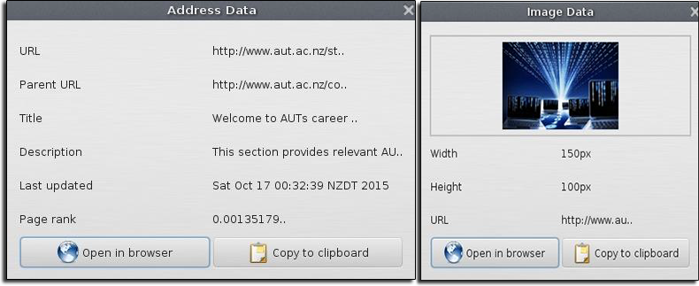

# NG Search Engine

## Features
- #### Web search

- #### Image search

- #### Customizable workers

- #### Configurable crawler

- #### View page result URL node data

## Installation
- [Download](https://github.com/kyleruss/ng-search-engine/releases/latest) the latest release
- Unzip the contents
- Run `NGSearchEngine.exe`

## License
NG Search Engine is available under the MIT License  
See [LICENSE](LICENSE) for more details
