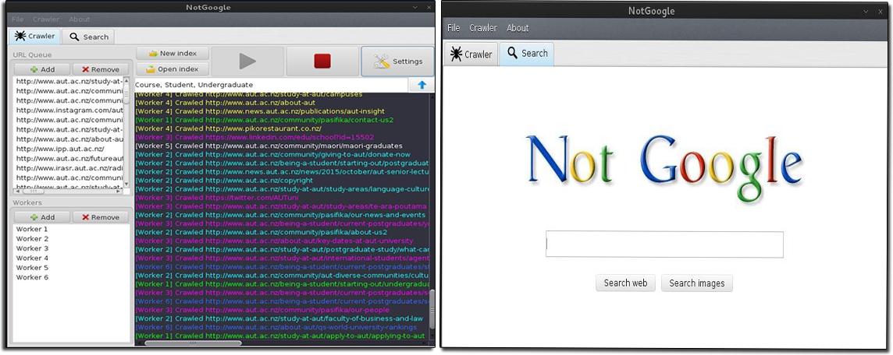
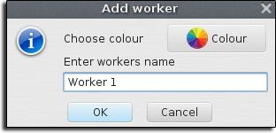

# NG Search Engine

NG (NotGoogle) is a neat search engine that utilizes the [PageRank](https://en.wikipedia.org/wiki/PageRank) algorithm  
The application consists of a crawling component and a search component where the crawling component  
runs many _workers_ concurrently which traverse the web, collect selective data of the websites visited and ranks them  
The data generated by the workers builds up an _index_ which is stored in an SQLite database  
The search engine component queries the index for a particular search string and retrieves relevant  
webite and image results to the user. For a comprehensive guide of the application see [Documentation](Documentation.pdf)

## Features

### Web search

### Image search

### Customizable workers

### Configurable crawler

### View page result URL node data

## Installation
- [Download](https://github.com/kyleruss/ng-search-engine/releases/latest) the latest release
- Unzip the contents
- Run `NGSearchEngine.exe`

## License
NG Search Engine is available under the MIT License  
See [LICENSE](LICENSE) for more details
